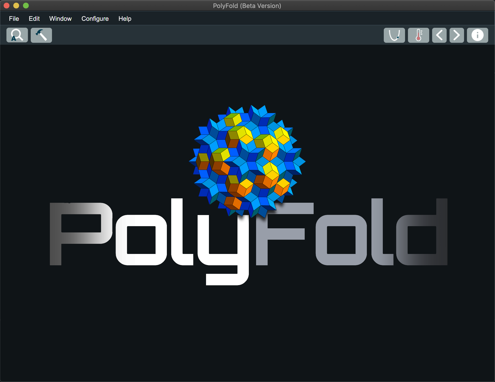
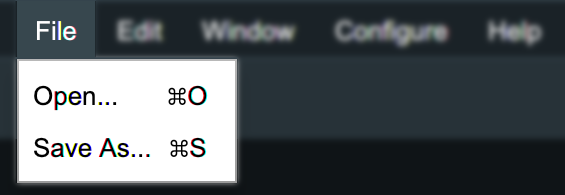
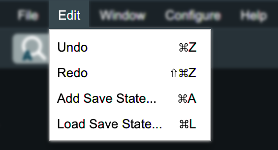
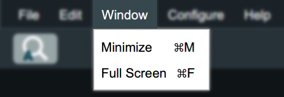
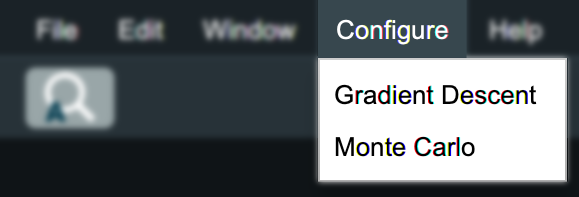

PolyFold is an interactive visual simulator for distance-based protein folding 
dynamics. The goal of PolyFold is to give citizen scientists and academic 
scientists alike an intuitive and visually appealing tool which elucidates the
process of folding proteins with common machine learning optimization 
techniques in real time. It is the hope of the PolyFold team that this tool will 
serve to fill out the gaps in the user's intuition and understanding of the way 
certain types of proteins respond to certain types of optimization strategies.

No prior scientific background is needed to work with PolyFold. It is built
entirely with human intuition in mind.

## How to Compile and Run the Source Code

### Using Make
1. Run the following line to compile the code:
```
$ make
```
2. Run the following line to run the application:
```
$ make run
```

### Using the JRE
1. Run the following line to compile the code:
```
$ javac PolyFold.java
```
2. Run the following line to run the application:
```
$ java PolyFold
```
## Manual

Upon opening PolyFold you will be greeted by a screen which looks similar to this:



You will notice that there is a menu bar and a tool bar at the top of the screen. Let's go through each item of the menu bar. 

### Menu Bar

#### File Menu


The file menu contains options for opening ".rr" files and saving the current state of a folded protein in PolyFold as a ".pdb" file. 

#### Edit Menu


The edit menu contains options to Undo and Redo changes made within PolyFold, as well as to Save or Load a named save state of a folded protein from the current PolyFold session.

#### Window Menu


The window menu contains options for minimizing the current window or making it full screen.

#### Configure Menu


The configure window contains options for changing the configuration of either the gradient descent or the Monte Carlo optimization strategies.

#### Help Menu


The help menu contains an option for opening PolyFold's "About" window. This contains information about the application, authors, and license of PolyFold. It can also redirect you to PolyFold's website hosted on GitHub.

Now let's explore the tool bar.

### Tool Bar


#### AutoZoom Button

The AutoZoom button attempts to move the PolyFold camera such that the majority of the protein structure is rendered in the current frame. It can also be activated by pressing the "A" key. 


#### Repair Button

The Repair button adjusts all of the planar and dihedral angles for each alpha helix and beta strand residue in the current protein such that they fall within acceptable ranges for those secondary structures. 


#### Gradient Descent Button

The Gradient Descent button will start a gradient descent optimization on the current protein structure.


#### Monte Carlo Button

The Monte Carlo button will start a Monte Carlo optimization on the current protein structure. 


#### Undo Button

The Undo button will undo the previous change that was applied to the current protein structure.


#### Redo Button

The Redo button will redo the previous change that was applied to the current protein structure.


#### Info Button

The Info button opens PolyFold's "About" window. This contains information about the application, authors, and license of PolyFold. It can also redirect you to PolyFold's website hosted on GitHub.
