PolyFold is an interactive visual simulator for distance-based protein folding
dynamics. The goal of PolyFold is to give citizen scientists and academic
scientists alike an intuitive and visually appealing tool which elucidates the
process of folding proteins with common machine learning optimization
techniques in real time. It is the hope of the PolyFold team that this tool will
serve to fill out the gaps in the user's intuition and understanding of the way
certain types of proteins respond to certain types of optimization strategies.

No prior scientific background is needed to work with PolyFold. It is built
entirely with human intuition in mind.


<p align='center'>
<em>PolyFold optimizes target T0864 in real-time via its Batch Gradient Descent feature</em>
</p>

## Dataset
PolyFold's source code includes with it a set of 20 curated Residue-Residue files for various sized protein targets. Each entry in the table below contains a GIF visualization of the interaction map for one of these proteins as it is optimized. Each GIF has a label below it with the protein's name and the number of residues in that protein in parenthesis. All GIFs also link to the raw text Residue-Residue file for download for their respective protein. 


<a href="Dataset/1guuA.rr">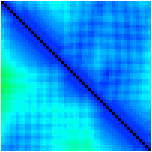</a> | <a href="Dataset/1brfA.rr">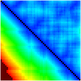</a> | <a href="Dataset/1aapA.rr"></a> | <a href="Dataset/1jo8A.rr">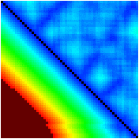</a> | <a href="Dataset/1ku3A.rr">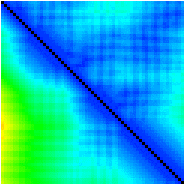</a> 
 :-: | :-: | :-: | :-: | :-:
1guuA (50) | 1brfA (53) | 1aapA (56) | 1jo8A (58) | 1ku3A (61)
<a href="Dataset/1m8aA.rr">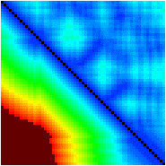</a> | <a href="Dataset/1c9oA.rr">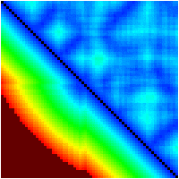</a> | <a href="Dataset/1vfyA.rr">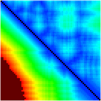</a> | <a href="Dataset/1ctfA.rr">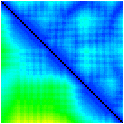</a> | <a href="Dataset/1kw4A.rr">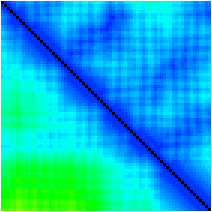</a> 
1m8aA (61) | 1c9oA (66) | 1vfyA (67) | 1ctfA (68) | 1kw4A (70)
<a href="Dataset/1cc8A.rr">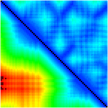</a> | <a href="Dataset/1atzA.rr">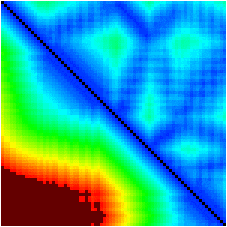</a> | <a href="Dataset/1tifA.rr">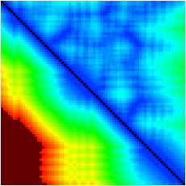</a> | <a href="Dataset/1h98A.rr">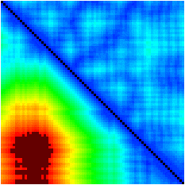</a> | <a href="Dataset/1t8kA.rr">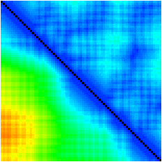</a> 
1cc8A (72) | 1atzA (75) | 1tifA (76) | 1h98A (77) | 1t8kA (77)
<a href="Dataset/1a3aA.rr">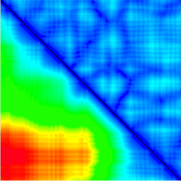</a> | <a href="Dataset/1xdzA.rr"></a> | <a href="Dataset/T0864.rr"></a> | <a href="Dataset/T0950.rr"></a> | <a href="Dataset/T0966.rr"></a> 
1a3aA (145) | 1xdzA (238) | T0864 (246) | T0950 (342) | T0966 (492)

## How to Compile and Run the Source Code

It is extremely important that you use the correct version of Java in order for PolyFold to function properly. PolyFold is designed for long term support and thus runs on Java 11. The Java 11 JDK and JRE can be downloaded at https://www.oracle.com/technetwork/java/javase/downloads/jdk11-downloads-5066655.html

### Environment Variables
PolyFold depends on two environment variables in order to function properly - JAVA_HOME and JAVAFX_HOME. 

The JAVA_HOME variable needs to point to your installation of Java 11. More specifically it needs to point to the parent directory of the `bin` directory. The JAVAFX_HOME variable needs to point to your JavaFX installation. More specifically, it points to the `lib` directory within your JavaFX installation. On my Mac, these directories happen to be exported as:
```
export JAVA_HOME=/Library/Java/JavaVirtualMachines/jdk-11.0.5.jdk/Contents/Home
export JAVAFX_HOME=/Library/Java/JavaFX/javafx-sdk-11.0.2/lib
```
On my Debian machine, these directories happen to be:
```
export JAVA_HOME=/usr/lib/jvm/jdk-11.0.5
export JAVAFX_HOME=/usr/lib/jvm/javafx-sdk-11.0.2/lib
```
NOTE: all the above listed directories could vary on your own machine. 

### Using Maven
#### Mac OS
1. If you do not have homebrew installed, you can install it with
```
$ /usr/bin/ruby -e "$(curl -fsSL https://raw.githubusercontent.com/Homebrew/install/master/install)"
```
2. Install Maven
```
$ brew install maven
```
3. Export the correct environment variables. Add them to your profile or rc file for persistence
```
$ export M2_HOME=/usr/local/Cellar/maven/<version_here>
$ export M2=$M2_HOME/bin
$ export PATH=$M2:$PATH
```
4. Verify the install and correct environment variables with
```
$ mvn -v
```
5. Change into the PolyFold directory which should contain `pom.xml`
6. Compile
```
$ mvn clean javafx:jlink
```
7. Run
```
$ ./target/PolyFold/bin/launcher
```
#### Debian Based Linux
1. Use your package manager to install Maven (apt shown below)
```
$ sudo apt install maven
```
2. Export the correct environment variables. Add them to your profile or rc file for persistence
```
$ export M2_HOME=/usr/share/maven/
$ export M2=$M2_HOME/bin
$ export PATH=$M2:$PATH
```
3. Verify the install and correct environment variables with
```
$ mvn -v
```
4. Change into the PolyFold directory which should contain `pom.xml`
5. Compile. If lots of text litters your terminal screen don't panic! Maven may need to download supplementary files here.
```
$ mvn clean javafx:jlink
```
6. Run
```
$ ./target/PolyFold/bin/launcher
```
#### Windows
If you wish to install PolyFold on Windows it is recommended that you do so on a 64 bit Windows 10 installation using the IntelliJ IDE.
1. Ensure that the Maven plugin suite is installed in IntelliJ.
2. Open the PolyFold project in IntelliJ (the directory which contains `pom.xml` is the project directory).
3. Click on the Maven plugin tab on the right-hand side of IntelliJ.
4. Navigate the directory hierarchy to:
```
Plugins > JavaFX > javafx:jlink
```
5. Double click on `javafx:jlink`. This will trigger the build process.
6. Run `launcher.bat` to launch PolyFold
