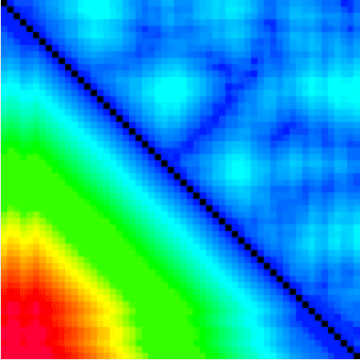

PolyFold is an interactive visual simulator for distance-based protein folding. 
The goal of PolyFold is to give both researchers and non-experts an intuitive 
and easy-to-use visual interface which elucidates the process of distance-based 
protein folding. PolyFold embeds powerful stochastic optimization algorithms 
with on-demand customizations and interactive manipulations in real-time to 
fold a protein molecule through the satisfaction of spatial constraints derived 
from a protein's inter-residue distance matrix.

If you find PolyFold useful, please [cite our paper in arXiv](http://arxiv.org/abs/2002.11592) where it is available as preprint. A detailed user manual of PolyFold is available [here](MANUAL.pdf), accompanying the paper as supplementary documentation.

<em>PolyFold optimizes the CASP target T0864 in real-time via its Batch Gradient Descent feature</em>

## Dataset
PolyFold's source code includes with it a set of 20 curated residue-residue interaction map files for various sized protein targets. Each entry in the table below contains a GIF visualization of the interaction map for one of these proteins as it is optimized. Each GIF has a label below it with the protein's name and the number of residues in that protein in parenthesis. All GIFs also link to the raw RR file for download for their respective protein. 

 |  |  |  |  
 :-: | :-: | :-: | :-: | :-:
1guuA (50) | 1brfA (53) | 1aapA (56) | 1jo8A (58) | 1ku3A (61)
 |  |  |  |  
1m8aA (61) | 1c9oA (66) | 1vfyA (67) | 1ctfA (68) | 1kw4A (70)
 |  |  |  |  
1cc8A (72) | 1atzA (75) | 1tifA (76) | 1h98A (77) | 1t8kA (77)
 |  |  |  |  
1a3aA (145) | 1xdzA (238) | T0864 (246) | T0950 (342) | T0966 (492)

## Installation

The provided manual gives instructions for installing the pre-packaged versions of PolyFold for Mac, Linux, and Windows or for building PolyFold from source. 
